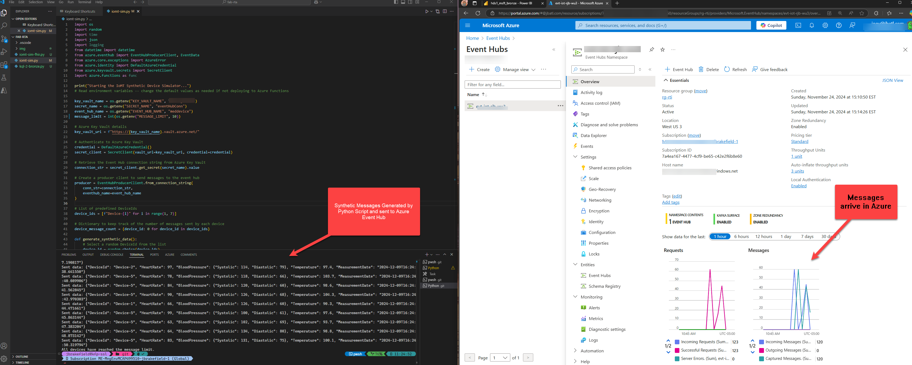
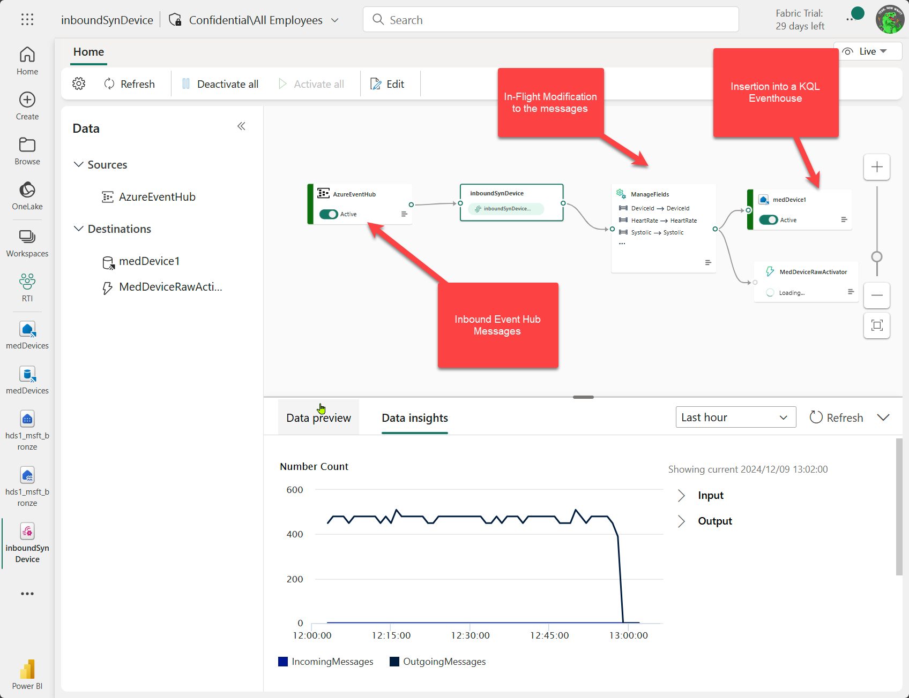
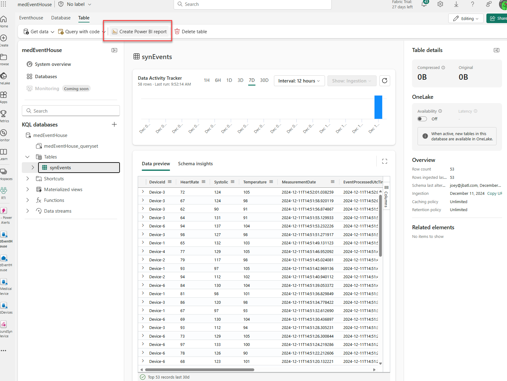
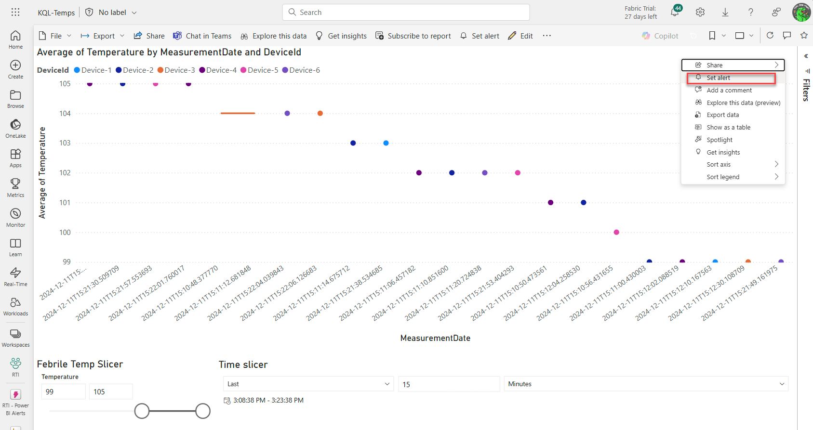
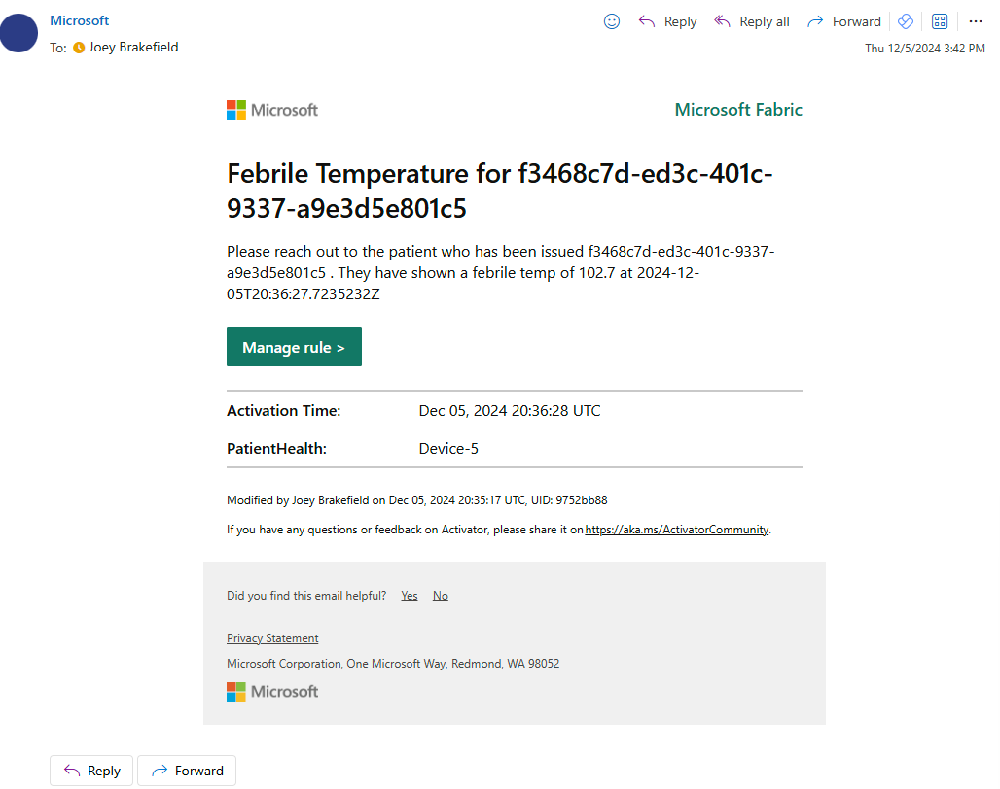

# The Importance of Real-Time Data Ingestion in Healthcare Analytics

Driving Analytical Post-Mortem Decisions with Precision

In today's rapidly evolving healthcare landscape, the ability to make informed and timely decisions is paramount. One of the key factors in enabling this agility is the use of real-time data ingestion to drive analytical business decisions. This approach not only enhances the accuracy of medical insights but also improves patient outcomes, optimizes resource allocation, and ensures compliance with stringent regulatory standards. We’ll look at Microsoft Fabric’s Real-Time Intelligence (RTI) experience to learn more about how we can support this landscape in this blog post followed closely by a second blog describing how to integrate more deeply with Fabric’s Healthcare Data Solutions.

## The Need for Real-Time Data Ingestion

The healthcare industry generates an immense volume of data, ranging from patient records and laboratory results to imaging studies and device readings. Traditionally, this data has been ingested and processed in batches, leading to delays in analysis and decision-making. However, the dynamic nature of healthcare demands a more immediate approach to data handling. Real-time data ingestion addresses this need by capturing and processing data as it is generated, providing healthcare professionals with up-to-the-minute insights.

### Enhanced Patient Care

Real-time data ingestion enables healthcare providers to monitor patients continuously and respond promptly to any changes in their condition. For instance, real-time monitoring of vital signs allows for early detection of anomalies, facilitating timely interventions that can prevent complications and save lives. [Real-time dashboards](https://learn.microsoft.com/en-us/fabric/real-time-intelligence/dashboard-real-time-create) and Power BI dashboards are part and parcel of the Real-Time Intelligence experience in Microsoft Fabric.

### Near Real-Time Resource Analysis

By analyzing data in real time, healthcare facilities can optimize the use of their resources. This includes managing the availability of staff, equipment, and beds more effectively, ensuring that patients receive the care they need without unnecessary delays.   
  
In my scenario, we are building a real-time dashboard to detect and notify if a patient’s simulated medical device sends temperatures over 102 degrees Fahrenheit.

### Regulatory Compliance

Healthcare organizations are subject to strict regulations regarding data handling and patient privacy. Real-time data ingestion helps ensure compliance by providing accurate and timely records of all healthcare activities, which can be crucial during audits and inspections. RTI inherits the compliance capability of HITRUST, HIPAA, various ISO specifications, and other regulations. You can find [out more here](https://aka.ms/azurecompliance).

# Creating a Sample Repository for Real-Time Intelligence

To demonstrate the value of real-time data ingestion, I decided to [create a sample repository](https://github.com/kfprugger/fab-rta) that simulates a medical device. This repository sends data to the Real-Time Intelligence module in Microsoft Fabric, where it is used for downstream analytics within the Fabric Healthcare Data Solutions platform.

## Simulating a Medical Device

The first step was to simulate a medical device that generates continuous data streams. This could be a wearable health monitor, a smart glucose meter, or any other device that collects patient data. The simulated device was configured to produce data at regular intervals, mimicking the real-world operation of such devices. I created the **iomt-sim.py** script to send data to an Azure Event Hub. From there we’ll pick up the events and put them into Fabric using RTI-specific approaches.

  
  
In my example, I am creating 6 devices issued to fictitious patients that are constantly emitting data to an Azure Event Hub. Included in that synthetic data is blood pressure, temperature, and heart rate. In the configuration below, we’re ingesting that information into Fabric within an artifact called an “[Eventhouse](https://learn.microsoft.com/en-us/fabric/real-time-intelligence/eventhouse)” that will store the real-time and allow for near-real time alerting via Microsoft Fabric’s Activator feature.

## Data Ingestion into Microsoft Fabric

The next step involved setting up the data ingestion into Fabric using [an event stream](https://learn.microsoft.com/en-us/fabric/real-time-intelligence/event-streams/overview?tabs=enhancedcapabilities). The simulated device data was sent to Microsoft Fabric's Real-Time Intelligence (RTI) experience using native integration with Azure and Fabric-native connectors. The RTI experience is designed to handle high-velocity data streams, ensuring that the incoming data is processed and stored efficiently and then, optionally, sent to analytics for further processing.

To set this up, you’ll need to follow these steps assuming you already have either a Fabric capacity or trial at your disposal to use for this example.

1.  Go to Fabric (app.powerbi.com)
2.  Create a workspace. In my example, I am using a workspace called **RTI.** Navigate to
3.  Create an Event Stream
4.  Set the database source as the Azure Event Hub you’ve set up.
5.  Next, I am expanding out complex data types. In my example, it’s just putting the Diastolic and Systolic measurements for blood pressure that I am splitting into different columns.   
      
    NOTE: this isn’t necessarily needed, I’m just demonstrating that you can change the inbound data before they hit the KQL database for storage and, later, analytics.
6.  Now, we can deposit the data somewhere. I am choosing a KQL database called “MedDevice1”

## Reacting to Real-Time Healthcare Data

Data flows in from IoT devices every second and we need a way to react to changes from these devices quickly. The portion of Fabric dedicated to this task is the Real-Time Intelligence experience. Here we’re looking for device messages that give us a warning when a metric we care about for patient health, temperature, goes into a febrile category (over 99 degrees Fahrenheit).

To do this, we must capture data as outlined above and then work on the reaction or “reflex” to that data as it meets the alert criteria. This part of Fabric [is called “Activator”](https://learn.microsoft.com/en-us/fabric/real-time-intelligence/data-activator/activator-introduction) and within Activator, you can enable multiple reflexes to send emails, Teams chats, custom events, etc. when a certain condition occurs.

To this, I built out a [near real-time dashboard](https://learn.microsoft.com/en-us/fabric/real-time-intelligence/data-activator/activator-get-data-power-bi) in Power BI using the **Create Power BI report** , then used the in-built **Set alert** icon on the Power BI dashboard that I built., then I built a real-time dashboard that would allow me to look at temperatures over time.   

## Alerting

Once there, I just adjusted the settings of the alert to show a message in my email inbox stating there is a febrile temperature on a device (which would be mapped to a patient) and to reach out to the patient to do a health check with that patient.  
  

## Downstream Analytics

Once ingested, the data becomes available for consumption in the Fabric Healthcare Data Solutions platform. This platform provides a suite of analytical tools that can be used to derive insights from the data. For example, it can detect patterns and trends, perform predictive analytics, and generate insights based on operational, financial, socioeconomic, and clinical data domains. This portion will be covered in Part 2 of my blog on Real-Time Healthcare analytics.

# Where This Lands Us…

The integration of real-time data ingestion into healthcare analytics represents a significant advancement in the industry. By enabling immediate access to critical data, healthcare providers can make more informed decisions, improve patient outcomes, and optimize their operations. The creation of a sample repository that simulates a medical device and sends data to Microsoft Fabric's Real-Time Intelligence module serves as a powerful example of how this technology can be leveraged to drive innovation in healthcare.

As the healthcare landscape continues to evolve, the adoption of real-time data integration will undoubtedly play a crucial role in shaping the future of medical practice. By embracing this approach, healthcare organizations can ensure that they remain at the forefront of technological advancements, delivering the highest standard of care to their patients.

# Questions and Follow-Up

As I mentioned, I will be publishing a second portion of this blog that talks about integrating these observations from patient devices into Fabric Healthcare Data Solutions.

Please check my [GitHub repo](https://github.com/kfprugger/fab-rta) and blog to find out more! Cheers!
